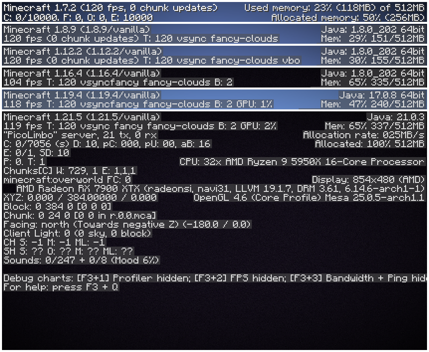

# PicoLimbo

[](https://github.com/Quozul/PicoLimbo/actions)
[](https://github.com/Quozul/PicoLimbo/releases)
[](LICENSE)
[](https://discord.gg/M2a9dxJPRy)

An ultra-lightweight, multi-version Minecraft limbo server written in Rust.
It currently supports all Minecraft versions from 1.7.2 through 1.21.5.

---

## Community & Support

If you have any questions or suggestions, join the [Discord server](https://discord.gg/M2a9dxJPRy)!

## Introduction

PicoLimbo is a lightweight [limbo server](https://quozul.dev/posts/2025-05-14-what-are-minecraft-limbo-servers/) written
in Rust, designed primarily as an AFK or waiting server. Its core focus is on efficiency by implementing only essential
packets required for client login and maintaining connection (keep-alive) without unnecessary overhead.

When idle, PicoLimbo uses almost no resources: 0% CPU and less than 10 MB of memory, making it extremely lightweight.

While not aiming to replicate every Minecraft server feature, PicoLimbo supports **all Minecraft versions from 1.7.2
through 1.21.5**, excluding snapshots, with only 24 implemented packets covering over 45 Minecraft versions.

## Features

### ⚙️ Highly Configurable

PicoLimbo uses a simple TOML configuration file (`server.toml` by default) for easy setup and customization. Set a
welcome message for players, default spawn dimension, custom server list Message Of The Day and more.  
👉 See the [Configuration](#example-configuration-file) section for full details.

### 🚀 Velocity Proxy Support

Built-in support for [Velocity](https://papermc.io/software/velocity) Modern Forwarding ensures seamless integration
with your Velocity proxy. Just set the
`secret_key` in your configuration to enable secure forwarded player info.

### 🔀 BungeeCord Support

PicoLimbo also supports [BungeeCord](https://www.spigotmc.org/wiki/bungeecord/) proxy by default. Because BungeeCord
connections are insecure by default, no additional configuration is required to use it with PicoLimbo.

### 🎮 Wide Version Compatibility

One binary, multiple Minecraft versions! PicoLimbo supports **Minecraft 1.7.2 through 1.21.5** natively — no ViaVersion
or ViaBackwards needed. *(Snapshots are not supported.)*

### ⚡ Lightweight and Efficient

PicoLimbo is designed to be extremely lightweight, consuming **0% CPU while idle** and using **less than 10 MB of memory
**, making it perfect for low-resource environments and always-on servers.

  
*The screenshot shows just a few of the supported Minecraft versions.*

---

## Getting Started

### 🚀 Pterodactyl (Recommended)

For users running the Pterodactyl panel, deployment is simplified with the provided [egg file](./pterodactyl/eggs). This
egg is built on the lightweight Alpine base image, ensuring efficient resource usage.

The egg supports additional installation configuration through the following environment variables:

- **VERSION**  
  Specifies the Git tag of the release to install. This can be a stable or prerelease tag (e.g., `v1.21.5`).
    - Default: `latest`
    - When set to `latest` (or left unset without enabling prerelease), the installer selects the newest stable release.

- **USE_PRERELEASE**  
  When set to `true`, the installer ignores stable releases and installs the newest prerelease based on publication
  date.
    - Default: *(empty)*

Velocity Modern Forwarding can be enabled by configuring the `secret_key` in the server’s `server.toml` configuration
file as usual.

### Using Docker

The Docker image is multi-platform, supporting both Linux/amd64 and Linux/arm64 architectures. You can easily start the
server using the following command:

```shell
docker run --rm -p "25565:25565" ghcr.io/quozul/picolimbo:master
```

You can also mount a custom configuration file:

```shell
docker run --rm -p "25565:25565" -v /path/to/your/server.toml:/usr/src/app/server.toml ghcr.io/quozul/picolimbo:master
```

### Using Docker Compose

For a more managed and scalable setup, use Docker Compose. A sample [docker-compose.yml file](./docker-compose.yml) is
available in the repository. Simply download the `docker-compose.yml` file and run:

```shell
docker compose up
```

### Binary / Standalone

> [!IMPORTANT]
> Ensure the `assets` directory is placed alongside the PicoLimbo binary, as it contains essential files required for
> server execution.

#### GitHub Releases

Download pre-compiled binaries for multiple platforms from
the [GitHub releases page](https://github.com/Quozul/PicoLimbo/releases). No Java or other dependencies required.

#### Compiling from Source with Cargo

To build PicoLimbo from source, you can use Cargo:

```bash
cargo install --git https://github.com/Quozul/PicoLimbo.git pico_limbo
```

---

## Documentation

### Command Line Usage

1. Run the server:
   ```bash
   pico_limbo
   ```
2. Use a custom configuration file:
   ```bash
   pico_limbo --config /path/to/custom/config.toml
   ```
3. Enable verbose logging:
   ```bash
   pico_limbo -v  # Debug logging
   pico_limbo -vv # Trace logging
   ```

### Example Configuration File

A default configuration file will be automatically generated the first time you start the server.

```toml
# Server binding address and port
bind = "0.0.0.0:25565"

# Velocity Modern Forwarding secret key (optional)
secret_key = ""

# Spawn dimension (overworld, nether, or end)
spawn_dimension = "overworld"

# Server list settings
max_players = 500
message_of_the_day = "§aWelcome to PicoLimbo"

# Welcome message sent to players after spawning, only sent to 1.19+ clients
welcome_message = "§7You are now in the limbo server."
```

---

## Similar Projects

- [Limbo](https://github.com/LOOHP/Limbo) — Supports only one Minecraft version at a time
- [NanoLimbo](https://github.com/Nan1t/NanoLimbo) — Actively maintained
  (see [BoomEaro's fork](https://github.com/BoomEaro/NanoLimbo/tree/feature/1.21.2))
- [TyphoonLimbo](https://github.com/TyphoonMC/TyphoonLimbo) — No longer actively maintained
- [LiteLimbo](https://github.com/ThomasOM/LiteLimbo) — No longer actively maintained

---

## Contributing

Contributions are welcome! If you encounter any issues or have suggestions for improvement, please submit an issue or
pull request on GitHub. Make sure to follow the existing code style and include relevant tests.

1. Fork the repository.
2. Create a new branch `git checkout -b <branch-name>`.
3. Make changes and commit `git commit -m 'Add some feature'`.
4. Push to your fork `git push origin <branch-name>`.
5. Submit a pull request.
